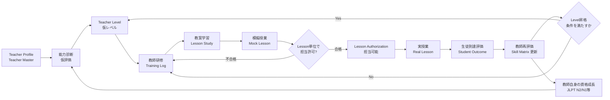
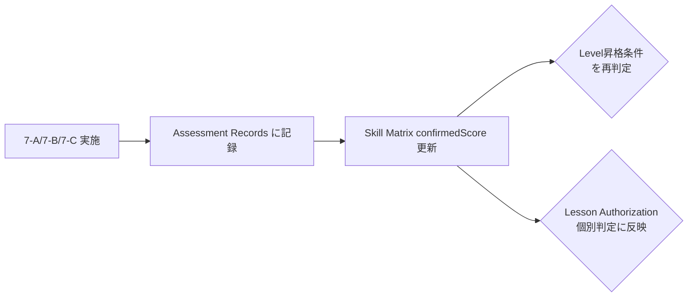
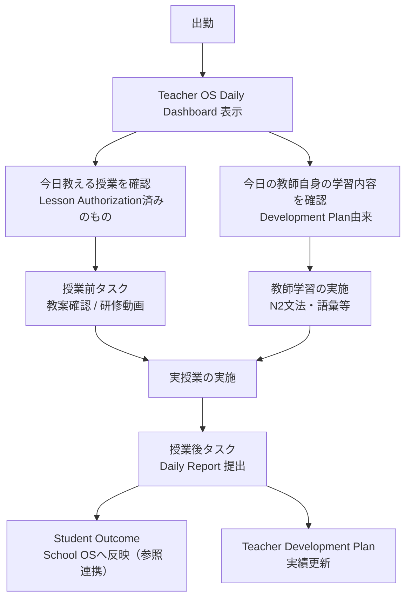
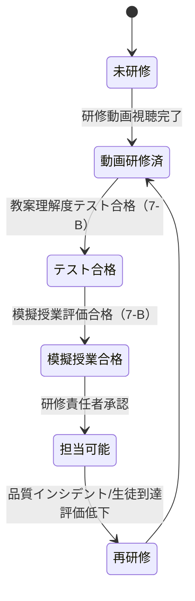

# OUKA Teacher OS 設計書（v0.1 ドラフト）

> **本書のステータス**: 設計のみ。実装コードなし。
> **変更禁止範囲**: 既存 School OS（`apps-script/*.gs`）、128日教材本体、既存ホームページ機能は本書では一切変更しません。
> Teacher OS は既存 School OS と**並走する別モジュール**として設計します（詳細は §10）。

---

## 0. 目的とスコープ

Teacher OS は勤怠管理システムではない。目的は次の2つを同時に満たすこと。

1. **教師自身を育成する**（先生も生徒、という思想）
2. **誰が教えても一定品質の授業を再現できるようにする**（属人化の排除）

そのために、教師を「経歴 → 診断 → レベル → 研修 → 教案学習 → 模擬授業 → 担当許可 → 実授業 → 生徒到達評価 → 再評価 → 資格成長」まで**一本のパイプライン**で管理する。

本書では以下を提出する（実装はしない）。

1. Teacher OS全体構造
2. Teacher Master項目
3. Madhu初期Profile
4. Shanti初期Profile
5. Teacher Skill Matrix
6. Teacher Level昇格条件
7. 教師能力診断テスト案
8. 1日の教師運用フロー
9. 128日教材との接続方法
10. 既存School OSとの接続方法

---

## 1. Teacher OS 全体構造

### 1.1 コアパイプライン



**設計原則**

- 各矢印は「自動遷移」ではなく「判定ポイント」。人（研修責任者・校長等）またはテストの合格が遷移条件になる（§6, §7）。
- Teacher Level は「Lessonを教えてよい範囲の目安」であって、Lesson単位の担当許可を一括で与えない（§7の思想を継承、詳細は §9）。
- 生徒到達評価（Student Outcome）は School OS の Journey / 学習進捗データを参照し、教師の再評価にフィードバックする（§10）。

### 1.2 モジュール構成

| モジュール | 役割 | 主キー |
|---|---|---|
| Teacher Master | 教師の基本情報台帳 | `teacherId` |
| Teacher Skill Matrix | 日本語力・指導力・職場教育力の評価（仮評価/確定評価） | `teacherId` + `skillCode` |
| Teacher Level History | レベル判定の履歴（昇格・降格・理由・承認者） | `teacherId` + `effectiveDate` |
| Teacher Development Plan | 教師自身の学習計画・実績（月次） | `teacherId` + `yearMonth` |
| Assessment Records | 診断テスト・実力試験の結果 | `teacherId` + `testId` |
| Lesson Authorization Matrix | Teacher×LessonごとのProgressステータス | `teacherId` + `lessonId` |
| Daily Ops Log | 日次の「教える授業」「自己学習」「事前/事後タスク」実績 | `teacherId` + `date` |
| Student Outcome Reference | 生徒到達度（School OS参照のみ、書き込みしない） | `studentId` + `lessonId` |

### 1.3 データ思想

- Teacher OS は Student側の School OS（Student Master / Journey）と**IDで疎結合**する。Teacher OS が Student Master を直接編集することはない。
- 「仮評価」と「確定評価」は必ず別カラムで保持する（経歴だけで確定させない、という要件を構造的に担保）。
- Lesson単位の許可情報は Teacher Level から独立したテーブルとして持つ（レベルだけで一括許可しない）。

---

## 2. Teacher Master 項目

| # | 項目 | 型/例 | 備考 |
|---|---|---|---|
| 1 | Teacher ID | `OUKA-TCH-0001` | 発行元はTeacher OS側（School OSのstudentId採番方式に合わせる） |
| 2 | 氏名 | 文字列 | ローマ字/現地語 両方保持を推奨 |
| 3 | 日本滞在年数 | 数値（年） | 入社時点のヒアリング値。更新は年1回見直し |
| 4 | 日本での学校 | 文字列 | 日本語学校／大学等、複数可 |
| 5 | 専攻 | 文字列 | 大学等の専攻 |
| 6 | 日本での職歴 | 文字列（複数可） | 業種・職種・役職・期間 |
| 7 | 日本語教師経験年数 | 数値（年） | OUKA入社前の経験も含める |
| 8 | 最大担当人数 | 数値 | これまでの最大クラスサイズ実績 |
| 9 | 指導経験レベル | 文字列 | 例: N5まで／N4まで等、自己申告＋実績 |
| 10 | JLPT | 列挙 | 保有級／未保有／受験予定 |
| 11 | JFT | 列挙 | 合格／不合格／未受験 |
| 12 | その他資格 | 文字列（複数可） | 日本語教育能力検定試験 等 |
| 13 | 得意分野 | タグ（複数可） | Skill Matrixの上位項目と連動（§5） |
| 14 | 現在の目標資格 | 文字列 | 例: JLPT N2 |
| 15 | 入社日 | 日付 | |

**運用ステータス項目（提案・任意）**: `雇用形態`, `在籍ステータス（在籍/休職/退職）`, `所属拠点`。要否は運用側で確認。

---

## 3. Madhu 初期 Profile（Teacher Master）

| 項目 | 値 | 出典・備考 |
|---|---|---|
| Teacher ID | `OUKA-TCH-0001` | 仮採番 |
| 氏名 | Madhu Neupane | |
| 日本滞在年数 | 約10年 | ヒアリング値 |
| 日本での学校 | 日本語学校 卒業／日本の大学 卒業 | |
| 専攻 | Business Management | |
| 日本での職歴 | ホテル勤務（スタッフマネジメント経験あり） | |
| 日本語教師経験年数 | 約3年 | |
| 最大担当人数 | 約20名 | |
| 指導経験レベル | N4まで指導経験あり | |
| JLPT | **未保有**（要受験・§7で確定評価） | 経歴だけでは確定させない |
| JFT | 情報なし（要確認） | |
| その他資格 | 情報なし（要確認） | |
| 得意分野（仮） | 日本生活／日本文化／日本職場教育／マネジメント／N5・N4指導 | Skill Matrix仮評価より |
| 現在の目標資格 | JLPT N2 → 将来的にN1 | |
| 入社日 | 要確認（TBD） | |

**初期レベル候補: T2（Standard Teacher）候補**
根拠: N4までの指導実績、10年の在日経験、マネジメント経験、20名規模のクラス運営実績。ただしJLPT資格が未保有のため、**T2確定は日本語能力確認テスト（§7-A）合格が条件**。

---

## 4. Shanti 初期 Profile（Teacher Master）

| 項目 | 値 | 出典・備考 |
|---|---|---|
| Teacher ID | `OUKA-TCH-0002` | 仮採番 |
| 氏名 | Shanti Paudel | |
| 日本滞在年数 | 約4年半 | |
| 日本での学校 | 情報なし（要ヒアリング） | |
| 専攻 | 情報なし（要ヒアリング） | |
| 日本での職歴 | コンビニ勤務（接客経験） | |
| 日本語教師経験年数 | 約1年 | |
| 最大担当人数 | 約10名 | |
| 指導経験レベル | N5指導経験あり | |
| JLPT | 情報なし（未保有と推定、要確認） | |
| JFT | **合格** | |
| その他資格 | なし | |
| 得意分野（仮） | N5／初級会話／日本生活／接客／時間管理／職場マナー | Skill Matrix仮評価より |
| 現在の目標資格 | JLPT N2 | |
| 入社日 | 要確認（TBD） | |

**初期レベル候補: T1（Basic Teacher）候補**
根拠: N5指導実績、JFT合格、コンビニ接客での実務日本語運用経験。指導年数が浅いため、教授力面はT1相当からの育成を前提とする。

---

## 5. Teacher Skill Matrix

### 5.1 評価軸（0〜5段階、共通スケール）

| スコア | 意味 |
|---|---|
| 0 | 未評価／該当経験なし |
| 1 | 見習いレベル（補助が必須） |
| 2 | 基礎レベル（定型業務のみ単独可） |
| 3 | 標準レベル（通常業務を単独遂行可） |
| 4 | 熟練レベル（イレギュラー対応・他者への簡易アドバイス可） |
| 5 | 指導者レベル（他教師への指導・研修設計に関与可） |

### 5.2 カテゴリと項目

**Japanese Ability**: Grammar / Vocabulary / Reading / Listening / Speaking / Writing / Pronunciation

**Teaching Ability**: 教案理解 / 文法説明 / 語彙説明 / 発音指導 / 会話授業 / 板書 / 生徒への質問 / 宿題管理 / テスト実施 / クラス管理

**Japan Work Education**: 日本文化 / 日本生活 / 時間管理 / 報連相 / 職場マナー / 接客 / 面接 / 日本企業理解

### 5.3 「仮評価」と「確定評価」の分離（構造）

| カラム | 内容 |
|---|---|
| `provisionalScore` | Profile（経歴）から推定した仮スコア |
| `provisionalBasis` | 仮評価の根拠（経歴のどの部分か） |
| `confirmedScore` | 診断テスト・実力試験・模擬授業観察後の確定スコア |
| `confirmedDate` | 確定日 |
| `assessor` | 評価者（試験官／観察者） |
| `evidence` | 試験結果ID・模擬授業観察記録へのリンク |

**運用ルール**: `confirmedScore` が空のスキルはLesson Authorization判定や昇格判定に使用しない。仮評価はあくまで研修計画立案用。

### 5.4 Madhu 仮評価（Profileベース、試験前）

| Japanese Ability | 仮 | | Teaching Ability | 仮 | | Japan Work Education | 仮 |
|---|---|---|---|---|---|---|---|
| Grammar | 3 | | 教案理解 | 3 | | 日本文化 | 5 |
| Vocabulary | 3 | | 文法説明 | 3 | | 日本生活 | 5 |
| Reading | 3 | | 語彙説明 | 3 | | 時間管理 | 4 |
| Listening | 4 | | 発音指導 | 3 | | 報連相 | 4 |
| Speaking | 4 | | 会話授業 | 4 | | 職場マナー | 4 |
| Writing | 3 | | 板書 | 3 | | 接客 | 3 |
| Pronunciation | 4 | | 生徒への質問 | 3 | | 面接 | 3 |
| | | | 宿題管理 | 3 | | 日本企業理解 | 4 |
| | | | テスト実施 | 3 | | | |
| | | | クラス管理 | 4 | | | |

根拠: 10年の在日実生活・N4指導実績（Japanese Ability上振れ）、ホテル勤務でのマネジメント経験（クラス管理・日本企業理解）。**JLPT未保有のためJapanese Abilityは全項目、日本語能力確認テストで確定評価に置き換える（§7-A）。**

### 5.5 Shanti 仮評価（Profileベース、試験前）

| Japanese Ability | 仮 | | Teaching Ability | 仮 | | Japan Work Education | 仮 |
|---|---|---|---|---|---|---|---|
| Grammar | 2 | | 教案理解 | 2 | | 日本文化 | 3 |
| Vocabulary | 2 | | 文法説明 | 2 | | 日本生活 | 4 |
| Reading | 2 | | 語彙説明 | 2 | | 時間管理 | 3 |
| Listening | 3 | | 発音指導 | 2 | | 報連相 | 2 |
| Speaking | 3 | | 会話授業 | 3 | | 職場マナー | 3 |
| Writing | 2 | | 板書 | 2 | | 接客 | 4 |
| Pronunciation | 3 | | 生徒への質問 | 2 | | 面接 | 2 |
| | | | 宿題管理 | 2 | | 日本企業理解 | 2 |
| | | | テスト実施 | 2 | | | |
| | | | クラス管理 | 2 | | | |

根拠: JFT合格・4.5年の在日生活（日本生活・接客が上振れ）、指導歴1年・N5経験のみ（Teaching Abilityは全体的に基礎〜標準未満）、報連相・面接は職務経験が浅く低め。

---

## 6. Teacher Level 昇格条件

| レベル | 定義 | 担当可能範囲 | 昇格に必要な条件（すべて満たす） | 承認者 |
|---|---|---|---|---|
| **T0** Training | 研修中 | 単独授業不可（同席・補助のみ） | — | — |
| **T1** Basic Teacher | 基礎教師 | N5・初級のみ（Lesson Authorization合格分のみ） | T0からの昇格: 教師研修一式修了 + 教案理解度テスト合格 + 模擬授業合格（N5レッスン） | 研修責任者 |
| **T2** Standard Teacher | 標準教師 | N4まで（Lesson Authorization合格分のみ） | 日本語能力確認テストでN4相当以上を確定 + Teaching Ability確定評価平均3.0以上 + N5〜N4 Lessonでの実授業実績（一定コマ数）+ 生徒到達評価が基準未満でないこと | 研修責任者＋校長 |
| **T3** Career Teacher | キャリア教師 | 職業日本語・日本文化・面接対策等を含む | 日本語能力確認テストでN3相当以上 + Japan Work Education確定評価平均4.0以上 + 模擬面接指導・模擬職業日本語授業の合格 | 校長 |
| **T4** Senior Teacher | 指導教師 | 他教師の指導・OJT担当可 | T3実績が一定期間 + 他教師への模擬指導評価合格 + Teaching Ability確定評価平均4.0以上、全項目3以上 | 校長＋運営 |
| **T5** Master Trainer | 教案・研修設計者 | 教案・教師研修そのものを改善提案・設計できる | T4実績が一定期間 + 教案改善提案の採用実績 + 研修設計レビュー合格 | 運営 |

**昇格の原則**

- **自動昇格は行わない。** すべて「試験合格」「模擬授業合格」「実績（コマ数・期間・生徒到達評価）」の3点セットが揃った時点で、人（承認者）が Teacher Level History に記録する。
- 昇格判定はLesson Authorization Matrix（§9）の状態とは独立。Levelは「担当してよい範囲の上限」を定義するだけで、実際に教えられるのはLesson単位で許可されたものだけ。
- **降格・再研修トリガー**（例）: 生徒到達評価が連続して基準を下回る／模擬授業の抜き打ち評価が基準未満／苦情等の品質インシデント。該当時はLevelを維持したままDaily OpsのTeacher Development Planに「再研修」タスクを強制付与する（Lesson Authorizationは個別Lessonごとに一時停止）。

---

## 7. 教師能力診断テスト案

Profileからの仮評価を「確定評価」に置き換えるためのテスト群。各テストの結果は Assessment Records に記録し、Skill Matrixの `confirmedScore` を更新する。

### 7-A. 日本語能力確認テスト（Japanese Ability確定用）

- **対象**: JLPT未保有の教師（例: Madhu）、または保有級が古い教師。
- **構成**: 文法／語彙／読解／聴解（JLPT形式の模試 or 相当レベルの過去問演習）＋ 面接形式の会話力チェック ＋ 簡易作文。
- **目的**: 「現時点の実力がN5〜N1のどのレベル相当か」を確定し、Skill MatrixのJapanese Ability各項目に反映。あわせて本人の公式資格取得（JLPT N2等）の学習計画（§7-D）につなげる。
- **合格基準**: レベル相当の基準点＋会話面接での実用会話評価。

### 7-B. 教授力実技試験（Teaching Ability確定用）

- **教案理解度テスト**: 対象Lessonの教案を読み、指導目標・展開・想定質問への回答をペーパー/口頭で確認。
- **模擬授業（Mock Lesson）**: 研修責任者・同僚を生徒役にした模擬授業を実施し、Teaching Abilityの10項目をルーブリックで評価（§5.2のスケール使用）。
- **合格基準**: 平均3.0以上かつ最低項目2以上（Lesson単独担当の場合）。T3以降はより高い基準（§6参照）。

### 7-C. 日本職場教育理解度テスト（Japan Work Education確定用）

- **構成**: 報連相・時間管理・職場マナー・接客・面接想定問答のケーススタディ／ロールプレイ。
- **目的**: 生徒に「日本の職場で通用する振る舞い」を教えられるかを確認。
- **合格基準**: ケース対応の妥当性を研修責任者がルーブリック評価。

### 7-D. 教師自身の資格学習（診断とは別軸、継続モニタリング）

- JLPT N2/N1等、公式資格の学習進捗は Teacher Development Plan（§1.2, §8）で月次モニタリング。診断テストとは別に「今月の学習時間」「模試結果」を記録する。

**テスト結果の反映フロー**



---

## 8. 1日の教師運用フロー

### 8.1 フロー概要



### 8.2 表示イメージ（設計例、本文中の要求どおり）

```
Madhu
今日の授業: Day 21 Lesson 2
授業前: 教案確認 10分
教師学習: JLPT N2文法 20分
授業後: Daily Report 3分

Shanti
今日の授業: Day 8 Lesson 1
授業前: Teacher Training Video 15分
教師学習: N2語彙 20分
授業後: Daily Report 3分
```

### 8.3 各要素の生成ロジック（設計）

| 表示項目 | 生成元 |
|---|---|
| 今日の授業 | Lesson Authorization Matrix で「担当可能」ステータスのLessonのうち、当日のクラス割当（School OS側の時間割／クラス編成データ）と突合した結果 |
| 授業前タスク | 対象Lessonの担当ステータスが「動画研修済」未満なら研修動画、「テスト合格」未満なら教案確認、を自動提示 |
| 教師学習 | Teacher Development Planの当月計画から当日分を抽出（資格学習・研修動画・確認テスト・模擬授業・再研修のいずれか） |
| 授業後タスク | Daily Report（生徒の様子・進捗・困りごとを3分程度で記入）。ここでの入力がStudent OutcomeとSkill Matrix再評価の材料になる |

### 8.4 データの書き戻り先

- Daily Report → Daily Ops Log（教師OS） ＋ Student Outcome Reference（生徒の到達度、School OS Journeyと突合）
- 教師学習の実施実績 → Teacher Development Plan の実績欄（今月の学習時間の集計に使用）

---

## 9. 128日教材との接続方法

> 128日教材そのもの（内容・ファイル）には触れない。Teacher OSは教材に**IDで参照するだけの参照レイヤー**を上から重ねる。

### 9.1 Lesson ID 設計（案）

```
LESSON-D{day:3桁}-{seq:2桁}
例: Day 21 の Lesson 2 → LESSON-D021-02
```

- `day`: 128日教材のDay番号（1〜128）
- `seq`: その日の中でのLesson通し番号
- 実際のカリキュラム側にLesson IDの割当が既にある場合はそれを優先し、本設計のIDは対応表（マッピングテーブル）として持つ（教材ファイルは書き換えない）。

### 9.2 Teacher × Lesson 許可ステータス（状態機械）



- 状態は **Teacher ID × Lesson ID** の組で個別管理する。Teacher Levelが高くても、個別Lessonが「担当可能」になっていなければアサインしない（要求どおり、レベルによる一括許可はしない）。
- 「今日の授業」（§8）は、この状態が「担当可能」のLessonの中からのみ表示・アサインされる設計とする。

### 9.3 教材本体との接続点

- 教材の実データ（配置場所・フォーマット）は現状リポジトリ内に存在しない（本リポジトリはホームページ用）。したがって本設計では**教材側のLesson一覧を提供するデータソースへの参照契約**のみを定義する:
  - 必要な最小データ: `lessonId`, `day`, `title`, `objective`（指導目標）, `requiredSkillTags`（例: 文法説明・発音指導など、Skill Matrix項目と対応）
  - Teacher OSはこのデータソースを**読み取り専用**で参照し、Lesson Authorization Matrixの行を初期生成する。
- 教材の管理場所（Sheets／別リポジトリ等）が確定した時点で、上記契約に合わせたマッピング実装を別途行う（今回は設計のみ）。

---

## 10. 既存 School OS との接続方法

### 10.1 現状の School OS 構造（変更しない前提の再確認）

- ホームページ → Apps Script Web App（`Code.gs`）→ Google Sheets（`Student Master` / `Journey` / `Interview & Matching` / `Company Inquiries` / `Contacts`）＋ Slack通知（`SlackNotifier.gs`）
- 列マッピングは `SheetMapper.gs`、設定は `Config.gs`（`docs/school-os-integration.md`, `docs/data-schema.md` 参照）
- `studentId` は Apps Script側で `OUKA-YYYYMM-XXXX` 形式で発行

### 10.2 Teacher OS の位置づけ：並走する追加モジュール

Teacher OSは既存の4ファイル（`Code.gs`/`Config.gs`/`SheetMapper.gs`/`SlackNotifier.gs`）を変更せず、**新規のシート・新規のApps Scriptファイル（実装フェーズで追加）として並走**させる。

```mermaid
flowchart LR
    subgraph 既存 School OS（変更なし）
        SM[Student Master]
        JN[Journey]
        IM[Interview and Matching]
    end

    subgraph Teacher OS（新規・追加）
        TM[Teacher Master]
        SK[Teacher Skill Matrix]
        LV[Teacher Level History]
        DP[Teacher Development Plan]
        AR[Assessment Records]
        LA[Lesson Authorization Matrix]
        DL[Daily Ops Log]
    end

    JN -- studentId/lessonIdで参照のみ --> DL
    JN -- studentId/lessonIdで参照のみ --> SK
    DL --> AR
    AR --> SK
    SK --> LV
```

### 10.3 接続ルール

| 項目 | ルール |
|---|---|
| ID体系 | `teacherId` は `OUKA-TCH-XXXX` として独自採番（`studentId`の採番方式に倣うが別シーケンス） |
| Student側データの扱い | Teacher OSは `Journey`（生徒の到達度・進捗）を**参照専用**で読む。書き込みは行わない |
| 新規シート | `Teacher Master` / `Teacher Skill Matrix` / `Teacher Level History` / `Teacher Development Plan` / `Assessment Records` / `Lesson Authorization Matrix` / `Daily Ops Log` を追加（既存シート名・列とは独立） |
| 新規Apps Script | 既存4ファイルとは別ファイル（例: `TeacherOS_Code.gs` 等、実装フェーズで命名）として追加し、既存Web Appのエンドポイント・デプロイには影響を与えない |
| Slack通知 | 既存の `#os-inbox` とは別チャンネル（例: `#teacher-os`）を想定。既存の安全項目限定ルール（住所・健康情報等を送らない）を踏襲 |
| 生徒到達評価の接続 | `Journey` のステージ・テスト結果等を `studentId` + `lessonId` で突合し、Student Outcome Referenceとして Teacher OS 側に取り込む（コピーではなく参照/同期のみ、Student Master原本は不可侵） |

### 10.4 非破壊の原則（明記）

- 既存の `Code.gs` / `Config.gs` / `SheetMapper.gs` / `SlackNotifier.gs` は編集しない。
- 既存シート（`Student Master` 等）の列追加・改変は行わない。
- 128日教材ファイルは編集しない（§9.3のとおり参照契約のみ）。
- ホームページ（`teachers.html` 等）の公開情報（`assets/js/teachers-data.js`）は生徒・保護者向けの別データであり、Teacher OSの内部データ（Skill Matrix等）とは別管理とする。将来的に「対外公開用プロフィール」を自動生成する場合も、Teacher Master → 公開用データへの**一方向変換**として設計し、逆方向の書き込みは行わない。

---

## 11. 未確定事項・次のステップ（実装着手前に確認が必要）

- Madhu / Shanti の入社日、JFT有無、その他資格、学歴詳細（要ヒアリング）
- 128日教材の実データ所在（Sheets / 別リポジトリ / その他）とLesson一覧のフォーマット
- 診断テスト（§7）の実施者・実施頻度・合格ラインの最終確定（本書は案）
- Teacher Level昇格の承認フロー（誰が「研修責任者」「校長」役を担うかの実運用上の割当）
- Teacher OS用シートの命名・格納スプレッドシート（既存「桜花_管理表」に追加タブとするか、別スプレッドシートにするか）

---

*本書はTeacher OSの初期設計ドラフトです。実装（Apps Script追加、シート作成、UI構築等）は本書レビュー後の別フェーズで行います。*
